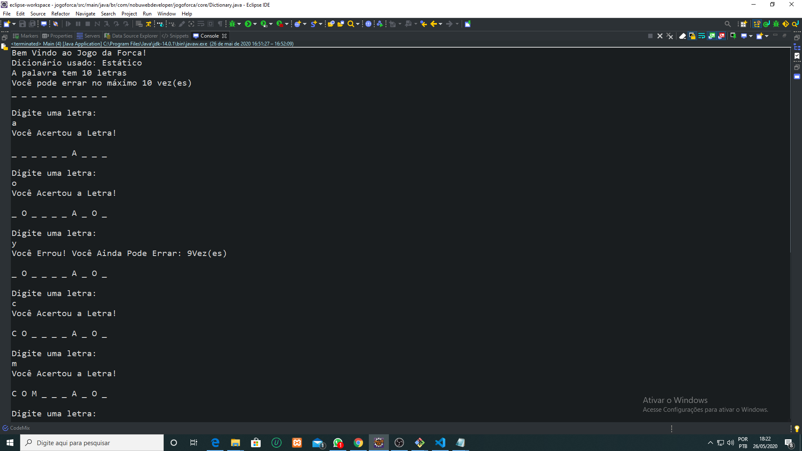
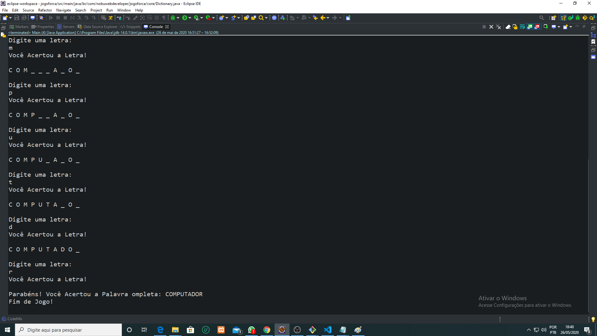

# Jogo-da-Forca 

Desenvolvimento de um jogo da forca. Este jogo foi projetado apenas para praticar o uso da orientação a objetos com java.  

Nas imagens abaixo segue os exemplos do jogo rodando no console do Eclipse:
 ## Imagem 1: Inserindo Jogadas. ##

## Imagem 2: Encerrando o Jogo. ##

